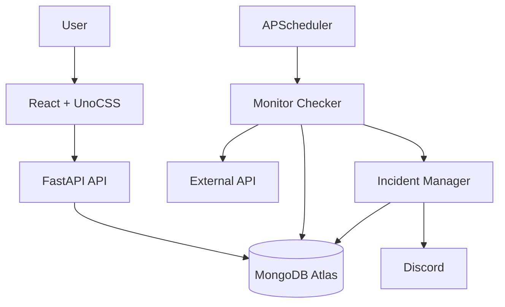
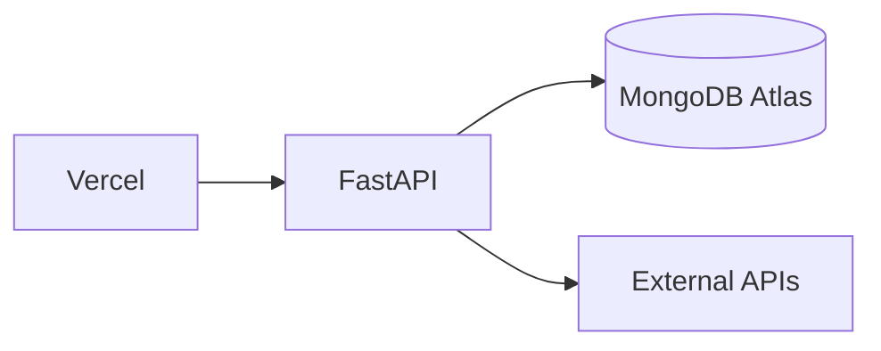

# APIWatch

Monitor your APIs. Track uptime. Detect failures before your users do.

APIWatch is a lightweight API and website monitoring platform. Add the endpoints you care about, and APIWatch periodically checks them, tracks uptime and response time, detects and de-duplicates outages into incidents, and alerts you on Discord the moment something breaks — and again the moment it recovers.

 

---

## Table of Contents

- [Overview](#overview)
- [Features](#features)
- [Architecture](#architecture)
- [How Monitoring Works](#how-monitoring-works)
- [Incident Detection](#incident-detection)
- [Uptime Calculation](#uptime-calculation)
- [Notifications](#notifications)
- [Security / SSRF Protection](#security--ssrf-protection)
- [Tech Stack](#tech-stack)
- [Project Structure](#project-structure)
- [MongoDB Atlas Setup](#mongodb-atlas-setup)
- [Local Setup](#local-setup)
- [Docker Setup](#docker-setup)
- [Environment Variables](#environment-variables)
- [API Documentation](#api-documentation)
- [Deployment](#deployment)
- [Scheduler Architecture](#scheduler-architecture)
- [Testing](#testing)
- [Future Improvements](#future-improvements)
- [License](#license)

---

## Overview

You give APIWatch a URL, an HTTP method, an interval, and what a "healthy" response looks like. It runs an immediate first check, then keeps checking on schedule — measuring response time, classifying each result as UP or DOWN, and rolling consecutive failures/successes into a state machine that opens and resolves **incidents** (not one alert per failed request). Everything is visible on a dark, technical dashboard: live status, uptime percentages, response-time charts, a status timeline, and incident history.

## Features

- Add API/website monitors with method, headers, body, timeout, interval, and expected status codes
- Manual on-demand health checks, throttled to prevent abuse
- Pause / resume monitoring per endpoint
- Configurable failure/recovery thresholds so a single blip doesn't flip status
- Automatic incident open/resolve — one incident per outage, not one per failed check
- Uptime percentage over 24h / 7d / 30d, computed from real check history (never fabricated)
- Response-time charts and a compact visual status timeline
- Discord notifications on outage and recovery, with a test-send button
- SSRF-hardened URL validation on every request path (create, update, manual check, scheduled check, redirects)
- Responsive UI: sidebar on desktop, drawer on mobile
- Configurable data retention for check history (incidents are kept)

## Architecture



The backend is layered so each concern has exactly one owner:

- **`api/`** — thin FastAPI routers. No business logic.
- **`services/`** — `MonitorService`, `CheckService`, `IncidentService`, `MetricsService`, `NotificationService`. Business logic and orchestration live here.
- **`monitoring/`** — the monitoring engine: `checker.py` (perform + classify a request), `scheduler.py` (APScheduler job lifecycle), `state.py` (the pure UP/DOWN/incident state machine), `url_validator.py` (SSRF checks).
- **`db/repositories/`** — the only code that talks to MongoDB.
- **`notifications/`** — `NotificationProvider` interface + `DiscordWebhookProvider`.

## How Monitoring Works

1. A monitor is created (or a scheduled job fires, or you click **Run Check**).
2. `URLValidator` re-validates the URL — every time, not just at creation (see [Security](#security--ssrf-protection)).
3. `MonitorChecker` sends the request with `httpx.AsyncClient`, bounded by the monitor's configured timeout.
4. Redirects (if `FOLLOW_REDIRECTS=true`) are followed manually, one hop at a time, up to a configured limit — and **each destination is re-validated against the same SSRF rules** before being followed.
5. The response status is compared against `expected_status_codes`. A match is `UP`; anything else (including a timeout) is `DOWN`.
6. The result is persisted as a `check`, and the monitor's state machine advances (see below).
7. If the transition opens or resolves an incident, enabled notification channels are notified.

A monitor is created with an **immediate** check — you're never staring at "UNKNOWN" until the first scheduled interval elapses.

### State machine

```text
UNKNOWN --(any success)--> UP
UNKNOWN/UP --(FAILURE_THRESHOLD consecutive failures)--> DOWN   [opens an incident]
DOWN --(RECOVERY_THRESHOLD consecutive successes)--> UP         [resolves the incident]
```

`PAUSED` is a separate, explicit state set by the pause/resume actions — a paused monitor has no scheduled job and the checker never runs against it. Resuming a monitor that has an **open incident** intentionally goes back to `DOWN` (not `UNKNOWN`) so the pause/resume cycle can never spawn a duplicate incident or leave one stuck open — this is covered by a regression test (`tests/test_monitor_crud.py::test_resume_while_down_keeps_same_incident_no_duplicate`).

## Incident Detection

`IncidentManager` logic (as `state.py` + `checker.py`):

- A failing check does **not** immediately create an incident — only crossing `FAILURE_THRESHOLD` consecutive failures does.
- While `DOWN`, further failures keep the **same** incident open. No duplicates.
- Crossing `RECOVERY_THRESHOLD` consecutive successes resolves the incident and records `resolved_at`.
- As a defense-in-depth safety net, `checker.py` refuses to open a second incident if one is already open for a monitor, regardless of what the state machine computes — this can only matter in edge cases (like the pause/resume scenario above) and is covered by tests.

## Uptime Calculation

```text
uptime = successful_checks / total_checks × 100
```

computed directly from the `checks` collection for the requested window (`24h` / `7d` / `30d`), using the indexed `(monitor_id, checked_at)` field so the query stays bounded. A monitor with **no checks in the window** reports `uptime_percentage: null` — APIWatch never fabricates a 100% (or any) uptime figure for missing data.

## Notifications

```python
class NotificationProvider(ABC):
    async def send(self, webhook_url: str, event: NotificationEvent) -> None: ...
```

`DiscordWebhookProvider` is the only implementation today; the interface is the extension point for Email/Slack/Telegram/Teams/generic webhooks later — nothing else in the codebase needs to change to add one.

- Notifications fire **only on state transitions** (outage open, incident resolve) — never once per failed check.
- Webhook URLs are encrypted at rest with Fernet (`ENCRYPTION_KEY`) and only ever surfaced to the API/UI as a masked string (e.g. `https://discord.com/api/webh••••••••••••`) — never the full URL, and never logged.
- A monitor can be wired to any subset of configured channels via `notification_channel_ids`.
- The Settings page has a **Test** button per channel that sends a real Discord message so you can confirm the webhook works before relying on it.

## Security / SSRF Protection

Monitoring arbitrary user-supplied URLs is inherently an SSRF risk — APIWatch is, by design, a service that makes outbound HTTP requests to addresses a user controls. `monitoring/url_validator.py` is the single place this is handled, and it's on the path for **every** request the app makes on a user's behalf: monitor create, monitor update, the ad-hoc "Test Request" button, every scheduled check, and every redirect hop.

What's blocked:

- Any scheme other than `http`/`https`
- Loopback addresses (`127.0.0.1`, `::1`, `localhost` and friends)
- RFC 1918 private ranges (`10.0.0.0/8`, `172.16.0.0/12`, `192.168.0.0/16`)
- Link-local addresses, including the cloud metadata endpoint `169.254.169.254`
- IPv6 unique-local (`fc00::/7`) and link-local (`fe80::/10`) ranges
- IPv4-mapped IPv6 addresses that resolve to any of the above (`::ffff:127.0.0.1`)

The hostname is actually **resolved** (via `getaddrinfo`) and every resolved address is checked — not just the literal string in the URL, so `http://[hostname-that-points-at-127.0.0.1]` is caught too. Redirects are disabled at the HTTP client level and followed manually so each hop can be validated before it's requested.

**Honest limitation:** this validates the resolved address immediately before connecting, not the exact address the underlying socket ultimately opens a connection to. A sufficiently well-timed DNS-rebinding attack (a name resolving to a public IP at validation time and a private IP microseconds later, when the TCP connection actually opens) is a known, hard-to-close gap without pinning the resolved IP and connecting to it directly — out of scope for a v1 portfolio implementation, and called out here rather than glossed over.

Other hardening:

- Request/interval/timeout/status-code/header/body-size limits are enforced server-side (Pydantic schemas), not just in the UI.
- Manual health checks are throttled per-monitor (`MANUAL_CHECK_THROTTLE_SECONDS`, default 5s) — `429 Too Many Requests` beyond that.
- CORS is an explicit allow-list (`CORS_ORIGINS`), not a wildcard.
- Errors returned to clients never include stack traces, MongoDB URIs, webhook URLs, or filesystem paths — see `app/errors.py`.

## Tech Stack

**Frontend:** React 19, TypeScript (strict), Vite, UnoCSS (no Tailwind, no shadcn/ui — a small custom component system built directly on UnoCSS utilities/shortcuts), TanStack Query, React Router, Recharts, Lucide icons.

**Backend:** Python 3.12, FastAPI, Pydantic v2, PyMongo's native async API (`pymongo.AsyncMongoClient` — not Motor), httpx, APScheduler, `cryptography` (Fernet) for webhook encryption.

**Database:** MongoDB Atlas.

**Testing:** pytest + pytest-asyncio + respx (backend, against a real Atlas test database), Vitest + React Testing Library (frontend).

## Project Structure

```text
apiwatch/
├── backend/
│   ├── app/
│   │   ├── main.py, config.py, errors.py, security.py, constants.py, dependencies.py
│   │   ├── api/            # health, monitors, checks, incidents, notifications routers
│   │   ├── db/              # client, indexes, repositories/
│   │   ├── models/          # Mongo-shaped documents
│   │   ├── schemas/         # request/response Pydantic schemas
│   │   ├── services/        # business logic
│   │   ├── monitoring/      # checker, scheduler, state machine, URL validator
│   │   └── notifications/   # provider interface + Discord
│   ├── tests/
│   ├── requirements.txt
│   └── Dockerfile
├── frontend/
│   ├── src/
│   │   ├── app/router.tsx
│   │   ├── components/{layout,dashboard,monitors,charts,incidents,common}/
│   │   ├── pages/            # Dashboard, MonitorDetails, MonitorForm, Incidents, Settings
│   │   ├── api/, hooks/, types/, lib/
│   │   └── main.tsx
│   ├── uno.config.ts
│   └── Dockerfile
├── docker-compose.yml
├── .env.example
└── README.md
```

## MongoDB Atlas Setup

APIWatch uses MongoDB Atlas — no local MongoDB container is provided (or recommended) by design.

1. Create a free account at [mongodb.com/cloud/atlas](https://www.mongodb.com/cloud/atlas).
2. Create a cluster (the free M0 tier is enough for this project).
3. **Database Access** → add a database user with a username/password.
4. **Network Access** → add an IP access entry. For local development, your current IP is fine; `0.0.0.0/0` works for quick testing but is not recommended long-term.
5. **Database** → **Connect** → **Drivers** → copy the connection string (`mongodb+srv://...`).
6. Put it in `backend/.env` as `MONGODB_URI`, and set `MONGODB_DATABASE=apiwatch`.
7. Start the backend — it pings MongoDB on startup and fails fast (with a clear log line) if it can't connect.

Indexes (`monitors.is_active`, `monitors.created_at`, `checks(monitor_id, checked_at)`, `incidents(monitor_id, status)`, `incidents(monitor_id, started_at)`, `notification_channels.enabled`) are created automatically and idempotently on every startup — nothing to run by hand.

## Local Setup

**Backend:**

```bash
cd backend
python3.12 -m venv .venv
source .venv/bin/activate
pip install -r requirements.txt
cp ../.env.example .env   # then fill in MONGODB_URI and ENCRYPTION_KEY
uvicorn app.main:app --reload
```

Generate a real `ENCRYPTION_KEY`:

```bash
python -c "from cryptography.fernet import Fernet; print(Fernet.generate_key().decode())"
```

**Frontend:**

```bash
cd frontend
npm install
cp .env.example .env 2>/dev/null || true  # or create .env with VITE_API_URL=http://localhost:8000
npm run dev
```

Visit `http://localhost:5173`. The API is at `http://localhost:8000`, with interactive docs at `http://localhost:8000/docs`.

## Docker Setup

```bash
cp .env.example backend/.env   # fill in MONGODB_URI and ENCRYPTION_KEY
docker compose up --build
```

This builds and runs two containers — `backend` (FastAPI + the embedded scheduler) and `frontend` (a static build served by nginx, with `VITE_API_URL` baked in at build time via a build arg). MongoDB is Atlas, not a container. Frontend: `http://localhost:5173`. Backend: `http://localhost:8000`.



## Environment Variables

See [`.env.example`](.env.example) for the full annotated list. The important ones:

| Variable | Purpose |
|---|---|
| `MONGODB_URI` / `MONGODB_DATABASE` | Atlas connection string and database name |
| `FAILURE_THRESHOLD` / `RECOVERY_THRESHOLD` | Consecutive checks before a status transition |
| `CHECK_RETENTION_DAYS` | How long check history is kept (incidents are never auto-deleted) |
| `MAX_REQUEST_BODY_SIZE_KB` | Cap on a monitor's configured request body |
| `FOLLOW_REDIRECTS` | Whether to follow (SSRF-revalidated) redirects during checks |
| `ENCRYPTION_KEY` | Fernet key used to encrypt Discord webhook URLs at rest |
| `CORS_ORIGINS` | Comma-separated allow-list for the frontend origin(s) |
| `ENABLE_SCHEDULER` | Keep `true` on exactly one backend instance — see below |
| `VITE_API_URL` (frontend) | Backend URL the browser talks to |

## API Documentation

FastAPI serves interactive docs at **`/docs`** (Swagger UI) and **`/redoc`** once the backend is running. Every endpoint has a description; error responses follow a consistent shape:

```json
{ "error": { "code": "SSRF_BLOCKED", "message": "The provided URL is not allowed." } }
```

## Deployment

```text
Frontend  → Vercel (or any static host)
Backend   → Render / Railway / Fly.io
Database  → MongoDB Atlas
Alerts    → Discord
```

- Set `VITE_API_URL` on the frontend host to your deployed backend URL.
- Set `CORS_ORIGINS` on the backend to your deployed frontend URL.
- Open MongoDB Atlas network access to your backend host's egress IP(s) (or `0.0.0.0/0` if your host uses dynamic IPs — tighten this if your provider supports static egress).
- **Run exactly one backend instance.** See [Scheduler Architecture](#scheduler-architecture) — this is the one hard constraint on how this deploys today.

## Scheduler Architecture

APScheduler runs **inside the FastAPI process**, with an in-memory job store, one job per active monitor (`monitor:<id>`), plus a retention-cleanup job every 6 hours. This is simple and correct for a single instance — and wrong the moment there's more than one:

> **Do not run more than one replica of the backend with `ENABLE_SCHEDULER=true`.** Every replica would register the same jobs and every monitor would be checked (and notified) multiple times per interval.

`uvicorn --reload`'s file-watcher reloader is fine — it only ever runs one worker process at a time, so it doesn't itself create duplicate schedulers. Running with `--workers N>1`, or multiple container replicas, would.

**Future scalable architecture**, if this ever needs to scale past one instance:

```text
                    ┌──────────────┐
                    │   Vercel     │
                    │   Frontend   │
                    └──────┬───────┘
                           │
                           ▼
                    ┌──────────────┐
                    │ API Servers  │  (stateless, horizontally scalable)
                    └──────┬───────┘
                           │
                           ▼
                    ┌──────────────┐
                    │ MongoDB Atlas│
                    └──────▲───────┘
                           │
                    ┌──────┴───────┐
                    │ Monitor Worker│  (single dedicated scheduler process)
                    │ Scheduler     │
                    └───────────────┘
```

Pulling the scheduler out into its own worker process (talking to the same MongoDB, with the API layer becoming pure CRUD) would let the API scale freely while keeping exactly one scheduler. Not implemented here — it's more machinery than a v1 needs.

## Testing

**Backend** (`cd backend && pytest`) — 62 tests against a real MongoDB Atlas database (`apiwatch_test`, separate from the dev database, wiped between tests), with outbound HTTP mocked via `respx`:

- URL validator: valid/invalid schemes, localhost, loopback, private ranges (v4 + v6), the cloud metadata address, IPv4-mapped IPv6
- Monitor CRUD, pause/resume, and scheduler job lifecycle (including the pause/resume-while-down regression test)
- Checker classification: 200/201/204 → UP, unexpected status/timeout → DOWN, redirects followed and SSRF-revalidated per hop, too-many-redirects handling
- Threshold state machine: configurable failure/recovery thresholds, no duplicate incidents on repeated failure, transient-failure recovery-streak reset
- Incident lifecycle: single incident per outage, single notification per transition, resolution + duration
- Notifications: Discord payload shape, failure handling, webhook masking/encryption round-trip, disabled channels excluded
- Uptime: 100%/50%/0%, empty-data returns `null` (never a fabricated 100%), period windowing

**Frontend** (`cd frontend && npm run test`) — Vitest + React Testing Library, focused on behavior: status badges always render text (not color alone), form validation (including a real bug this caught — `Number("")` evaluating to `0` in JS, which silently turned a cleared "expected status codes" field into `[0]` instead of `[]`), monitor card actions, incident card states, check history rendering.

Both suites, `npm run build` (strict TypeScript), and `docker compose up --build` were run as part of building this project, and the full app was driven end-to-end in a real headless browser: creating monitors against live public endpoints, verifying UP/DOWN classification and response times, incident open/resolve, SSRF rejection surfaced in the UI, pause/resume, manual-check throttling, and the mobile drawer/responsive layout.

## Future Improvements

- Pull the scheduler into a dedicated worker process (see [Scheduler Architecture](#scheduler-architecture)) to allow horizontal API scaling
- Additional notification providers (Email, Slack, Telegram, Microsoft Teams, generic webhook) behind the existing `NotificationProvider` interface
- Public status pages per monitor or monitor group
- Multi-region checks
- Auth/multi-tenancy (deliberately out of scope for v1 — see spec)

## License

MIT — see [LICENSE](LICENSE).
