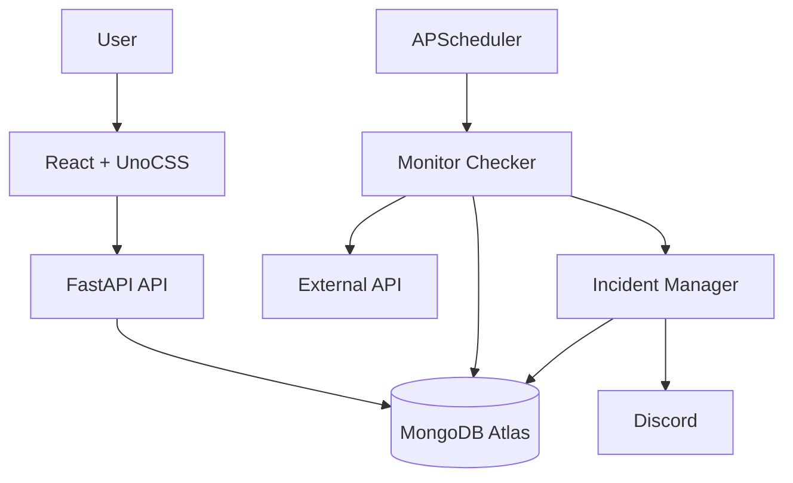
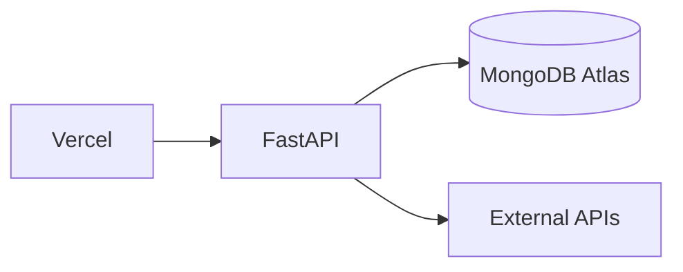

# APIWatch

Monitor your APIs. Track uptime. Detect failures before your users do.

APIWatch is a lightweight API and website monitoring platform. Add the endpoints you care about, and APIWatch periodically checks them, tracks uptime and response time, detects and de-duplicates outages into incidents, and alerts you on Discord the moment something breaks — and again the moment it recovers.

 

---

## Table of Contents

- [Overview](#overview)
- [Features](#features)
- [Architecture](#architecture)
- [How Monitoring Works](#how-monitoring-works)
- [Incident Detection](#incident-detection)
- [Uptime Calculation](#uptime-calculation)
- [Notifications](#notifications)
- [Security / SSRF Protection](#security--ssrf-protection)
- [Tech Stack](#tech-stack)
- [Project Structure](#project-structure)
- [MongoDB Atlas Setup](#mongodb-atlas-setup)
- [Local Setup](#local-setup)
- [Docker Setup](#docker-setup)
- [Environment Variables](#environment-variables)
- [API Documentation](#api-documentation)
- [Deployment](#deployment)
- [Scheduler Architecture](#scheduler-architecture)
- [Real-Time Updates](#real-time-updates)
- [Theming](#theming)
- [Testing](#testing)
- [Future Improvements](#future-improvements)
- [License](#license)

---

## Overview

You give APIWatch a URL, an HTTP method, an interval, and what a "healthy" response looks like. It runs an immediate first check, then keeps checking on schedule — measuring response time, classifying each result as UP or DOWN, and rolling consecutive failures/successes into a state machine that opens and resolves **incidents** (not one alert per failed request). Everything is visible on a dark, technical dashboard: live status, uptime percentages, response-time charts, a status timeline, and incident history.

## Features

- Add API/website monitors with method, headers, body, timeout, interval, and expected status codes
- Manual on-demand health checks, throttled to prevent abuse
- Pause / resume monitoring per endpoint
- Configurable failure/recovery thresholds so a single blip doesn't flip status
- Automatic incident open/resolve — one incident per outage, not one per failed check
- Uptime percentage over 24h / 7d / 30d, computed from real check history (never fabricated)
- Response-time charts and a compact visual status timeline
- Discord notifications on outage and recovery, with a test-send button
- SSRF-hardened URL validation on every request path (create, update, manual check, scheduled check, redirects)
- Responsive UI: sidebar on desktop, drawer on mobile, with hover/empty-state polish and honest handling of failed checks that never got a response (shown as "No response," not a misleading duration)
- Sortable, filterable dashboard with a grid/list view toggle (list preference persisted); incidents filterable by status and by monitor
- Tags per monitor (chip input, max 5) for grouping and dashboard filtering; bulk pause/resume/delete in list view
- Dark (default) and light themes, toggled from the topbar and persisted — a pure CSS-variable swap, since every component reads design tokens rather than raw colors
- Configurable data retention for check history (incidents are kept)
- Optional shared-secret access key protecting the whole API/UI on public deployments, with zero setup for local dev
- Multi-user accounts (email/password) — every account's monitors, checks, incidents, and notification channels are private to it
- Per-account monitor-creation limits (total cap + cooldown) to prevent abuse
- Discord, Telegram, and Email notification channels behind one shared `NotificationProvider` interface
- Public, unauthenticated status page per account (`/status/<slug>`) for opted-in monitors — name and status/uptime only, never the target URL
- Real-time dashboard updates over WebSocket the instant a check completes, with polling kept as an automatic fallback

## Architecture



The backend is layered so each concern has exactly one owner:

- **`api/`** — thin FastAPI routers. No business logic.
- **`services/`** — `MonitorService`, `CheckService`, `IncidentService`, `MetricsService`, `NotificationService`. Business logic and orchestration live here.
- **`monitoring/`** — the monitoring engine: `checker.py` (perform + classify a request), `scheduler.py` (APScheduler job lifecycle), `state.py` (the pure UP/DOWN/incident state machine), `url_validator.py` (SSRF checks).
- **`db/repositories/`** — the only code that talks to MongoDB.
- **`notifications/`** — `NotificationProvider` interface + `DiscordWebhookProvider`.

## How Monitoring Works

1. A monitor is created (or a scheduled job fires, or you click **Run Check**).
2. `URLValidator` re-validates the URL — every time, not just at creation (see [Security](#security--ssrf-protection)).
3. `MonitorChecker` sends the request with `httpx.AsyncClient`, bounded by the monitor's configured timeout.
4. Redirects (if `FOLLOW_REDIRECTS=true`) are followed manually, one hop at a time, up to a configured limit — and **each destination is re-validated against the same SSRF rules** before being followed.
5. The response status is compared against `expected_status_codes`. A match is `UP`; anything else (including a timeout) is `DOWN`.
6. The result is persisted as a `check`, and the monitor's state machine advances (see below).
7. If the transition opens or resolves an incident, enabled notification channels are notified.

A monitor is created with an **immediate** check — you're never staring at "UNKNOWN" until the first scheduled interval elapses.

### State machine

```text
UNKNOWN --(any success)--> UP
UNKNOWN/UP --(FAILURE_THRESHOLD consecutive failures)--> DOWN   [opens an incident]
DOWN --(RECOVERY_THRESHOLD consecutive successes)--> UP         [resolves the incident]
```

`PAUSED` is a separate, explicit state set by the pause/resume actions — a paused monitor has no scheduled job and the checker never runs against it. Resuming a monitor that has an **open incident** intentionally goes back to `DOWN` (not `UNKNOWN`) so the pause/resume cycle can never spawn a duplicate incident or leave one stuck open — this is covered by a regression test (`tests/test_monitor_crud.py::test_resume_while_down_keeps_same_incident_no_duplicate`).

## Incident Detection

`IncidentManager` logic (as `state.py` + `checker.py`):

- A failing check does **not** immediately create an incident — only crossing `FAILURE_THRESHOLD` consecutive failures does.
- While `DOWN`, further failures keep the **same** incident open. No duplicates.
- Crossing `RECOVERY_THRESHOLD` consecutive successes resolves the incident and records `resolved_at`.
- As a defense-in-depth safety net, `checker.py` refuses to open a second incident if one is already open for a monitor, regardless of what the state machine computes — this can only matter in edge cases (like the pause/resume scenario above) and is covered by tests.

## Uptime Calculation

```text
uptime = successful_checks / total_checks × 100
```

computed directly from the `checks` collection for the requested window (`24h` / `7d` / `30d`), using the indexed `(monitor_id, checked_at)` field so the query stays bounded. A monitor with **no checks in the window** reports `uptime_percentage: null` — APIWatch never fabricates a 100% (or any) uptime figure for missing data.

## Notifications

```python
class NotificationProvider(ABC):
    async def send(self, config: dict[str, str], event: NotificationEvent) -> None: ...
```

Three implementations today — `DiscordWebhookProvider`, `TelegramProvider`, `EmailProvider` — behind that one interface; Slack/Teams/generic-webhook later need nothing else in the codebase to change. `config` is the channel's decrypted, type-specific credential dict:

| Type | `config` shape | Delivery |
|---|---|---|
| Discord | `{"webhook_url": "..."}` | POST to the webhook |
| Telegram | `{"bot_token": "...", "chat_id": "..."}` | Telegram Bot API `sendMessage` |
| Email | `{"to_email": "..."}` | [Resend](https://resend.com)'s HTTP API, using one shared sender identity for the whole deployment (`RESEND_API_KEY`/`RESEND_FROM_EMAIL`) — not per-channel credentials |

- Notifications fire **only on state transitions** (outage open, incident resolve) — never once per failed check.
- A channel's config is stored as a single Fernet-encrypted JSON blob (`config_encrypted`) and only ever surfaced to the API/UI as a type-aware masked string (Discord: masked URL; Telegram: `Telegram chat •••1234`; Email: `j••••@example.com`) — never the full credential, and never logged. Changing a channel's *type* isn't supported as an edit (the config shape is different) — delete and recreate instead.
- A monitor can be wired to any subset of configured channels via `notification_channel_ids`; creating/updating a monitor validates every referenced channel actually belongs to the same account (`MonitorService._validate_notification_channel_ids`) — otherwise one account could point a monitor at another account's channel and spam it.
- The Settings page has a **Test** button per channel that sends a real message/email so you can confirm it works before relying on it. Adding an Email channel without `RESEND_API_KEY`/`RESEND_FROM_EMAIL` configured on the backend still saves the channel — sending fails with a clear "not configured" error rather than the app refusing to start.
- **Email over HTTP, not SMTP:** this started as a plain SMTP integration and was switched after hitting it in this project's own Render deployment — outbound SMTP on both port 587 (STARTTLS) and 465 (implicit TLS) timed out identically connecting to Gmail, the signature of a network-level block rather than a credentials problem. Most PaaS hosts (Render included, by report) block outbound SMTP as an anti-spam measure; a plain HTTPS POST to Resend's API is not affected, since blocking that would break the platform for everyone.

## Security / SSRF Protection

Monitoring arbitrary user-supplied URLs is inherently an SSRF risk — APIWatch is, by design, a service that makes outbound HTTP requests to addresses a user controls. `monitoring/url_validator.py` is the single place this is handled, and it's on the path for **every** request the app makes on a user's behalf: monitor create, monitor update, the ad-hoc "Test Request" button, every scheduled check, and every redirect hop.

What's blocked:

- Any scheme other than `http`/`https`
- Loopback addresses (`127.0.0.1`, `::1`, `localhost` and friends)
- RFC 1918 private ranges (`10.0.0.0/8`, `172.16.0.0/12`, `192.168.0.0/16`)
- Link-local addresses, including the cloud metadata endpoint `169.254.169.254`
- IPv6 unique-local (`fc00::/7`) and link-local (`fe80::/10`) ranges
- IPv4-mapped IPv6 addresses that resolve to any of the above (`::ffff:127.0.0.1`)

The hostname is actually **resolved** (via `getaddrinfo`) and every resolved address is checked — not just the literal string in the URL, so `http://[hostname-that-points-at-127.0.0.1]` is caught too. Redirects are disabled at the HTTP client level and followed manually so each hop can be validated before it's requested.

**Honest limitation:** this validates the resolved address immediately before connecting, not the exact address the underlying socket ultimately opens a connection to. A sufficiently well-timed DNS-rebinding attack (a name resolving to a public IP at validation time and a private IP microseconds later, when the TCP connection actually opens) is a known, hard-to-close gap without pinning the resolved IP and connecting to it directly — out of scope for a v1 portfolio implementation, and called out here rather than glossed over.

Other hardening:

- Request/interval/timeout/status-code/header/body-size limits are enforced server-side (Pydantic schemas), not just in the UI.
- Manual health checks are throttled per-monitor (`MANUAL_CHECK_THROTTLE_SECONDS`, default 5s) — `429 Too Many Requests` beyond that.
- CORS is an explicit allow-list (`CORS_ORIGINS`), not a wildcard.
- Errors returned to clients never include stack traces, MongoDB URIs, webhook URLs, or filesystem paths — see `app/errors.py`.

### Access control

Two independent layers, checked separately on every request (see `app/main.py`'s router wiring):

**1. Deployment gate (`API_ACCESS_KEY`, `app/auth.py`).** A monitoring dashboard sitting fully open on the public internet lets anyone create/pause/delete monitors, read incident history, and — the sharper edge — use your server to send outbound requests at any public URL of their choosing. A single shared secret, checked on every route except `/api/health` (so platform health checks keep working unauthenticated), closes that with the least machinery that actually works.

- **Unset** (the default): no gate at all. Fine for local dev.
- **Set**: every request needs `Authorization: Bearer <key>`, checked with a constant-time comparison.

**2. Per-account login (email/password, `app/services/auth_service.py`).** On top of the deployment gate, every monitor/check/incident/notification-channel document has an `owner_id`, and every repository query is scoped to it — one account's data is invisible to another's, not just hidden in the UI. Passwords are hashed with `bcrypt`; sessions are JWTs (`JWT_SECRET_KEY`, `JWT_EXPIRE_DAYS`, default 30 days) sent as `X-User-Token` — a header distinct from the access key's `Authorization`, so the two checks never interfere with each other, including which one clears which stored value on a 401 (see the `UNAUTHORIZED` vs `INVALID_SESSION` error codes). Signup is open to anyone who already has the deployment access key — effectively invite-only, no email verification, no password reset (noted under Future Improvements).

Both gates auto-detect on the frontend with a single probe request each (`AccessGate`, then nested `AuthGate`) — nothing to configure client-side, and rotating either secret doesn't require a rebuild since both tokens are entered at runtime and kept in `localStorage`, not baked into the build. When the deployment gate rejects the initial probe, `AccessGate` shows a public landing page (`frontend/src/pages/Landing.tsx`) — a marketing/feature overview with a "Sign In" call to action — rather than dropping a stranger straight onto a bare key-entry form; the key form only appears after they click through, or immediately if a previously-unlocked session gets revoked mid-use.

**Trade-off, stated plainly:** a JWT in `localStorage` is vulnerable to theft via XSS in a way an httpOnly cookie isn't. Accepted here — this app runs no third-party scripts — and avoids the real complexity of cross-site cookies between two different origins (Vercel frontend, Render backend), which is what `SameSite=None; Secure` cookies would require.

Set both `API_ACCESS_KEY` and `JWT_SECRET_KEY` on any deployment reachable from the public internet.

**Existing data migration:** monitors created before this feature shipped have no `owner_id` and become invisible to every account once ownership filtering is live (not deleted — just unmatched by any `{owner_id: ...}` query). `backend/scripts/assign_orphaned_monitors.py` is a one-off, not-part-of-the-app script to assign them to a specific account after you've signed up: `python scripts/assign_orphaned_monitors.py you@example.com --apply` (dry-run without `--apply`).

Separately, notification channels created before Telegram/Email support shipped are stored under the old single-field `webhook_url_encrypted` shape rather than the generalized `config_encrypted`. `backend/scripts/migrate_notification_channel_config.py --apply` converts them (also dry-run by default) — every pre-existing channel is Discord, so this is unambiguous and safe to run once after deploying.

### Monitor-creation abuse guards

Since signup only requires knowing the deployment access key (not an invite tied to a specific person), and a scheduled monitor checks a URL forever on its interval, an account could otherwise aim a large and growing amount of outbound traffic at a third party just by creating enough monitors. Two guards in `MonitorService`, both per-account:

- **`MAX_MONITORS_PER_OWNER`** (default 20) — a hard cap on total monitors, checked against a real count on every create. Bounds the worst case regardless of timing; deleting a monitor frees a slot, pausing doesn't.
- **`MONITOR_CREATE_COOLDOWN_SECONDS`** (default 10) — minimum gap between creates for the same account, same in-memory last-timestamp pattern as the existing manual-check throttle (`CheckService`). Slows down scripted burst creation specifically.

Both surface as a normal `AppError` (`MONITOR_LIMIT_EXCEEDED` / `RATE_LIMITED`) that the create-monitor form already displays via its existing error-message handling — no special-casing needed on the frontend.

### Public status pages

Each account has one status page at `/status/<slug>` — a third, unauthenticated route (`app/api/status_page.py`) that sits outside both gates above entirely, registered in `main.py` with no `dependencies=` at all (the same pattern as `/api/health`). Its access control is the slug itself: a `secrets.token_urlsafe(9)` value (~72 bits of entropy) generated lazily on first request (`GET /api/account/status-page`, behind the normal two-gate auth) rather than at signup, since most accounts never use it, and resolved server-side to exactly one account — never taken from anywhere but that lookup.

A monitor only appears there if its owner explicitly checks "Show on public status page" (`is_public`, off by default) *and* it's active — a paused monitor is dropped from the public list rather than shown mid-outage-forever. The response (`PublicStatusPage`/`PublicMonitorStatus`, `app/schemas/status_page.py`) is deliberately a narrow, separate shape from the authenticated `MonitorOut`: name, status, 24h/7d/30d uptime, and a short recent-checks sparkline — never the target URL, headers, body, or notification config, even to someone who has the link. `POST /api/account/status-page/regenerate` issues a new slug and immediately invalidates the old one (Settings page, "Regenerate Link") for when a link leaks somewhere it shouldn't have.

## Tech Stack

**Frontend:** React 19, TypeScript (strict), Vite, UnoCSS (no Tailwind, no shadcn/ui — a small custom component system built directly on UnoCSS utilities/shortcuts), TanStack Query, React Router, Recharts, Lucide icons.

**Backend:** Python 3.12, FastAPI, Pydantic v2, PyMongo's native async API (`pymongo.AsyncMongoClient` — not Motor), httpx, APScheduler, `cryptography` (Fernet) for webhook encryption, `bcrypt` + `PyJWT` for user auth.

**Database:** MongoDB Atlas.

**Testing:** pytest + pytest-asyncio + respx (backend, against a real Atlas test database), Vitest + React Testing Library (frontend).

## Project Structure

```text
apiwatch/
├── backend/
│   ├── app/
│   │   ├── main.py, config.py, errors.py, security.py, constants.py, dependencies.py, auth.py
│   │   ├── api/            # health, auth, monitors, checks, incidents, notifications routers
│   │   ├── db/              # client, indexes, repositories/ (incl. users)
│   │   ├── models/          # Mongo-shaped documents
│   │   ├── schemas/         # request/response Pydantic schemas
│   │   ├── services/        # business logic (incl. auth_service)
│   │   ├── monitoring/      # checker, scheduler, state machine, URL validator
│   │   └── notifications/   # provider interface + Discord
│   ├── scripts/             # one-off maintenance scripts, not part of the app
│   ├── tests/
│   ├── requirements.txt
│   └── Dockerfile
├── frontend/
│   ├── src/
│   │   ├── app/router.tsx
│   │   ├── components/{layout,dashboard,monitors,charts,incidents,common}/
│   │   ├── pages/            # Dashboard, MonitorDetails, MonitorForm, Incidents, Settings
│   │   ├── api/, hooks/, types/, lib/
│   │   └── main.tsx
│   ├── uno.config.ts
│   └── Dockerfile
├── docker-compose.yml
├── .env.example
└── README.md
```

## MongoDB Atlas Setup

APIWatch uses MongoDB Atlas — no local MongoDB container is provided (or recommended) by design.

1. Create a free account at [mongodb.com/cloud/atlas](https://www.mongodb.com/cloud/atlas).
2. Create a cluster (the free M0 tier is enough for this project).
3. **Database Access** → add a database user with a username/password.
4. **Network Access** → add an IP access entry. For local development, your current IP is fine; `0.0.0.0/0` works for quick testing but is not recommended long-term.
5. **Database** → **Connect** → **Drivers** → copy the connection string (`mongodb+srv://...`).
6. Put it in `backend/.env` as `MONGODB_URI`, and set `MONGODB_DATABASE=apiwatch`.
7. Start the backend — it pings MongoDB on startup and fails fast (with a clear log line) if it can't connect.

Indexes (`monitors.is_active`, `monitors.created_at`, `checks(monitor_id, checked_at)`, `incidents(monitor_id, status)`, `incidents(monitor_id, started_at)`, `notification_channels.enabled`) are created automatically and idempotently on every startup — nothing to run by hand.

## Local Setup

**Backend:**

```bash
cd backend
python3.12 -m venv .venv
source .venv/bin/activate
pip install -r requirements.txt
cp ../.env.example .env   # then fill in MONGODB_URI and ENCRYPTION_KEY
uvicorn app.main:app --reload
```

Generate a real `ENCRYPTION_KEY`:

```bash
python -c "from cryptography.fernet import Fernet; print(Fernet.generate_key().decode())"
```

**Frontend:**

```bash
cd frontend
npm install
cp .env.example .env 2>/dev/null || true  # or create .env with VITE_API_URL=http://localhost:8000
npm run dev
```

Visit `http://localhost:5173`. The API is at `http://localhost:8000`, with interactive docs at `http://localhost:8000/docs`.

## Docker Setup

```bash
cp .env.example backend/.env   # fill in MONGODB_URI and ENCRYPTION_KEY
docker compose up --build
```

This builds and runs two containers — `backend` (FastAPI + the embedded scheduler) and `frontend` (a static build served by nginx, with `VITE_API_URL` baked in at build time via a build arg). MongoDB is Atlas, not a container. Frontend: `http://localhost:5173`. Backend: `http://localhost:8000`.



## Environment Variables

See [`.env.example`](.env.example) for the full annotated list. The important ones:

| Variable | Purpose |
|---|---|
| `MONGODB_URI` / `MONGODB_DATABASE` | Atlas connection string and database name |
| `FAILURE_THRESHOLD` / `RECOVERY_THRESHOLD` | Consecutive checks before a status transition |
| `CHECK_RETENTION_DAYS` | How long check history is kept (incidents are never auto-deleted) |
| `MAX_REQUEST_BODY_SIZE_KB` | Cap on a monitor's configured request body |
| `FOLLOW_REDIRECTS` | Whether to follow (SSRF-revalidated) redirects during checks |
| `ENCRYPTION_KEY` | Fernet key used to encrypt notification channel credentials at rest |
| `RESEND_API_KEY` / `RESEND_FROM_EMAIL` | One shared sender identity for Email notification channels — only needed if you add one |
| `API_ACCESS_KEY` | Shared secret protecting the API — empty disables auth (local dev); **set this on any public deployment** |
| `JWT_SECRET_KEY` / `JWT_EXPIRE_DAYS` | Signs per-account login sessions — required, no default; rotating it logs everyone out |
| `MAX_MONITORS_PER_OWNER` / `MONITOR_CREATE_COOLDOWN_SECONDS` | Per-account monitor-creation abuse guards (default 20 monitors, 10s between creates) |
| `CORS_ORIGINS` | Comma-separated allow-list for the frontend origin(s) |
| `ENABLE_SCHEDULER` | Keep `true` on exactly one backend instance — see below |
| `VITE_API_URL` (frontend) | Backend URL the browser talks to |

## API Documentation

FastAPI serves interactive docs at **`/docs`** (Swagger UI) and **`/redoc`** once the backend is running. Every endpoint has a description; error responses follow a consistent shape:

```json
{ "error": { "code": "SSRF_BLOCKED", "message": "The provided URL is not allowed." } }
```

## Deployment

```text
Frontend  → Vercel (or any static host)
Backend   → Render / Railway / Fly.io
Database  → MongoDB Atlas
Alerts    → Discord
```

- Set `VITE_API_URL` on the frontend host to your deployed backend URL.
- Set `CORS_ORIGINS` on the backend to your deployed frontend URL — no trailing slash, it must match the browser's `Origin` header exactly.
- Set `API_ACCESS_KEY` and `JWT_SECRET_KEY` on the backend (see [Access control](#access-control)) — without them, the deployed instance is fully open to anyone with the URL.
- Open MongoDB Atlas network access to your backend host's egress IP(s) (or `0.0.0.0/0` if your host uses dynamic IPs — tighten this if your provider supports static egress).
- **Run exactly one backend instance.** See [Scheduler Architecture](#scheduler-architecture) — this is the one hard constraint on how this deploys today. This also means: don't leave a local `uvicorn` pointed at the same production `MONGODB_URI` running while your deployed instance is also up — both would register scheduler jobs for the same monitors, doubling check frequency and notifications.

## Scheduler Architecture

APScheduler runs **inside the FastAPI process**, with an in-memory job store, one job per active monitor (`monitor:<id>`), plus a retention-cleanup job every 6 hours. This is simple and correct for a single instance — and wrong the moment there's more than one:

> **Do not run more than one replica of the backend with `ENABLE_SCHEDULER=true`.** Every replica would register the same jobs and every monitor would be checked (and notified) multiple times per interval.

`uvicorn --reload`'s file-watcher reloader is fine — it only ever runs one worker process at a time, so it doesn't itself create duplicate schedulers. Running with `--workers N>1`, or multiple container replicas, would.

**Future scalable architecture**, if this ever needs to scale past one instance:

```text
                    ┌──────────────┐
                    │   Vercel     │
                    │   Frontend   │
                    └──────┬───────┘
                           │
                           ▼
                    ┌──────────────┐
                    │ API Servers  │  (stateless, horizontally scalable)
                    └──────┬───────┘
                           │
                           ▼
                    ┌──────────────┐
                    │ MongoDB Atlas│
                    └──────▲───────┘
                           │
                    ┌──────┴────────┐
                    │ Monitor Worker│  (single dedicated scheduler process)
                    │ Scheduler     │
                    └───────────────┘
```

Pulling the scheduler out into its own worker process (talking to the same MongoDB, with the API layer becoming pure CRUD) would let the API scale freely while keeping exactly one scheduler. Not implemented here — it's more machinery than a v1 needs.

## Real-Time Updates

The dashboard polls every `VITE_MONITOR_REFRESH_SECONDS` (default 30s) regardless — that stays as a correctness floor. On top of it, `WS /ws/updates` pushes a `monitor_updated` event the instant `MonitorChecker.run_check()` finishes (scheduled, manual, or the initial check on create/resume), so a status change usually shows up in well under a second instead of up to 30s late. The event carries just `{type, monitor_id}` — no duplicated payload to keep in sync with `MonitorOut` — and the frontend (`useRealtimeUpdates`) responds by invalidating the same React Query keys a poll would touch (`monitors`, `incidents`, `dashboard`) and letting the existing fetch paths pull fresh data. If the socket drops, `useRealtimeUpdates` reconnects on a fixed delay and the 30s poll keeps things eventually-consistent in the meantime — losing the socket degrades to "the app before this feature existed," never to "stuck."

**Why the socket authenticates itself, not the router.** Every other backend router is gated by `Depends(require_access_key)`/`Depends(get_current_user_id)`, reading the `Authorization`/`X-User-Token` headers. A browser's native `WebSocket` API can't set custom headers on the handshake request, so `/ws/updates` is registered with no router-level dependencies (`app/main.py`) and instead requires the first message *after* connecting to carry `{access_key, user_token}` (`app/api/realtime.py`) — validated by hand, connection closed with code `4401` if either is wrong, before it's ever registered to receive anything.

**`ConnectionManager` (`app/realtime.py`)** is an in-memory, per-account registry of live sockets — the same single-process assumption the embedded scheduler already makes (see above): fine at this app's scale, and a connection registered on one instance is invisible to a broadcast from another. Multiple backend replicas would need a shared pub/sub layer (e.g. Redis) for this to reach every connected client; not implemented here for the same reason the scheduler isn't distributed.

## Theming

Dark (default) and light themes, toggled from the topbar and persisted in `localStorage`. This works as a pure CSS-variable swap because it was true from the start of the project, not retrofitted: every component reads named design tokens (`bg-surface`, `text-muted`, `border-edge`, ...) that resolve to `var(--aw-*)` custom properties (`uno.config.ts` → `src/styles/theme.css`) — nothing in the codebase reaches for a raw hex value or a Tailwind-style `dark:` variant. Flipping `<html data-theme="light">` repaints the entire app instantly with no React re-render required; the light palette (`src/styles/theme.css`) keeps the same accent hue family as the dark one, deepened for AA contrast against light backgrounds.

The initial theme is applied by a small inline script in `index.html`, synchronously, before any CSS paints — a `useEffect` running after mount would visibly flash the wrong theme first. It reads a stored preference if one exists, or falls back to `prefers-color-scheme` for a first-time visitor; the topbar toggle (`useTheme`, `src/lib/theme.ts`) overrides and persists from there.

## Testing

**Backend** (`cd backend && pytest`) — 139 tests against a real MongoDB Atlas database (`apiwatch_test`, separate from the dev database, wiped between tests), with outbound HTTP mocked via `respx`:

- URL validator: valid/invalid schemes, localhost, loopback, private ranges (v4 + v6), the cloud metadata address, IPv4-mapped IPv6
- Monitor CRUD, pause/resume, and scheduler job lifecycle (including the pause/resume-while-down regression test)
- Checker classification: 200/201/204 → UP, unexpected status/timeout → DOWN, redirects followed and SSRF-revalidated per hop, too-many-redirects handling
- Threshold state machine: configurable failure/recovery thresholds, no duplicate incidents on repeated failure, transient-failure recovery-streak reset
- Incident lifecycle: single incident per outage, single notification per transition, resolution + duration
- Notifications: Discord/Telegram/Email payload shape and delivery, failure handling per provider (including Resend not configured, Resend's and Telegram's own error messages surfaced), config masking/encryption round-trip per type, disabled channels excluded
- Uptime: 100%/50%/0%, empty-data returns `null` (never a fabricated 100%), period windowing
- Auth: signup hashes the password (never stores plaintext), duplicate email rejected, wrong-password and unknown-email login both rejected identically, JWT round-trip, expired/malformed/mis-signed tokens rejected
- Ownership isolation: a monitor/notification channel created by one account is a 404 (not a 403 that would leak existence) to another account on every read/write path, `list_all`/dashboard-summary/all-incidents scoped per caller, and a monitor can't reference another account's notification channel
- Monitor-creation abuse guards: rejected once the per-account cap is reached, throttled by the per-account cooldown, both scoped so one account never blocks another
- Public status pages: slug assignment is idempotent and regeneration invalidates the old link, an unknown slug 404s, only monitors marked public *and* active appear, another account's public monitors never leak in, overall status is the worst of all shown monitors, uptime/recent-checks are computed correctly, and the target URL never appears anywhere in the public response shape
- Real-time updates: `ConnectionManager.broadcast` reaches only the target owner's connections (never another account's) and drops a dead connection after a failed send without disturbing the others; `MonitorChecker.run_check` broadcasts on completion (and is a no-op with no connection manager wired up, so every pre-existing test constructing a `MonitorChecker` directly keeps working unchanged); the `/ws/updates` handshake closes the connection on a wrong access key, an invalid/malformed user token, or a malformed first message, and registers/unregisters cleanly on a valid one
- Tags: trimmed, deduplicated case-insensitively, capped at 5, rejected if blank or over length; threaded through create (persisted, defaults to `[]`) and update (replaces when provided, left untouched when omitted)

**Frontend** (`cd frontend && npm run test`) — 62 tests, Vitest + React Testing Library, focused on behavior: status badges always render text (not color alone), form validation (including a real bug this caught — `Number("")` evaluating to `0` in JS, which silently turned a cleared "expected status codes" field into `[0]` instead of `[]`), monitor card actions, incident card states, check history rendering, the access-key and login gates (including that a locked-out account sees the right lock screen when the *other* gate is what actually failed, and that the public landing page — not a bare key form — is what a first-time stranger sees), the Settings page's per-type notification form (right fields shown per channel type, right payload shape submitted, no credential ever rendered into the DOM), the public status page (overall status banner, per-monitor status, not-found state, and that a target URL never renders), the Settings status-page section (link display, copy-to-clipboard, regenerate-with-confirmation), `useRealtimeUpdates` (sends stored credentials on connect, invalidates exactly the right query keys on a `monitor_updated` message and nothing else, ignores an unparseable message instead of throwing, reconnects after a drop, and doesn't reconnect after unmount), `useTheme` (reads the theme already applied to `<html>`, toggling flips the DOM attribute and persists it, and toggling twice returns to the original theme), `formatResponseTimeOrStatus` (a real check with a status code formats normally; a check that never got a response — timeout, SSRF block, connection failure — reads "No response," not a misleading duration), `sortMonitors` (each sort key orders correctly, missing uptime data sorts as worse than 0%, the input array is never mutated), `TagsInput` (Enter/comma commits a tag, duplicates are rejected case-insensitively, Backspace on an empty draft removes the last tag, the input disappears at the cap), and the Dashboard (tag filter narrows the list; entering select mode switches to list view and bulk-deletes only the checked monitors, leaving the rest untouched).

Both suites, `npm run build` (strict TypeScript), and `docker compose up --build` were run as part of building this project, and the full app was driven end-to-end in a real headless browser: creating monitors against live public endpoints, verifying UP/DOWN classification and response times, incident open/resolve, SSRF rejection surfaced in the UI, pause/resume, manual-check throttling, the mobile drawer/responsive layout; two separate accounts in two isolated browser contexts confirming account B's dashboard never shows account A's monitor and that navigating directly to account A's monitor URL as account B renders the same "not found" state as a genuinely deleted monitor; and adding a real Discord, Telegram, and Email channel through the Settings UI, confirming each shows the right type-specific fields, the right masked summary, no credential ever rendered into the page, and a clear "not configured" error when testing Email without Resend set up.

## Future Improvements

- Pull the scheduler into a dedicated worker process (see [Scheduler Architecture](#scheduler-architecture)) to allow horizontal API scaling
- Further notification providers (Slack, Microsoft Teams, generic webhook) behind the existing `NotificationProvider` interface — Discord, Telegram, and Email already implemented
- Multi-region checks
- Password reset and email verification (signup is currently invite-only via the deployment access key, with no email-ownership check)
- OAuth (GitHub/Google) as an alternative to email/password

## License

MIT — see [LICENSE](LICENSE).
